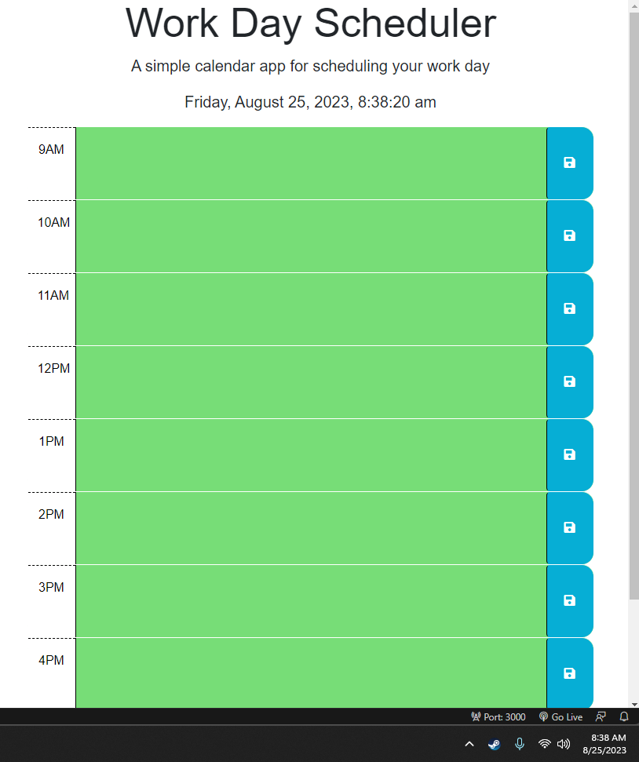

# Daily-Planner-Schedule
Helping a busy employee that has a busy schedule with a daily planner

# User Story
AS AN employee with a busy schedule  
I WANT to add important events to a daily planner  
SO THAT I can manage my time effectively  

# Acceptance Criteria
GIVEN I am using a daily planner to create a schedule  
WHEN I open the planner  
THEN the current day is displayed at the top of the calendar  
WHEN I scroll down  
THEN I am presented with time blocks for standard business hours of 9am to 5pm  
WHEN I view the time blocks for that day  
THEN each time block is color-coded to indicate whether it is in the past, present, or future  
WHEN I click into a time block  
THEN I can enter an event  
WHEN I click the save button for that time block  
THEN the text for that event is saved in local storage  
WHEN I refresh the page  
THEN the saved events persist  

# Mock-up GIF of Site

# Link to Live Site
https://thomas-barnhart.github.io/Daily-Planner-Schedule/

# Link to GitHub
https://github.com/Thomas-Barnhart/Daily-Planner-Schedule

# Final Use
A fillable schedule from 9am to 5pm that can have events added and will change colors in each time block as the local time changes.
